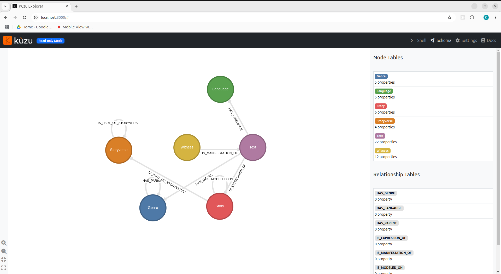

# Pivot Heurist database to TEI documents
[](https://creativecommons.org/licenses/by-sa/4.0/)

From the relational entities in LostMa's Heurist database, this package (1) transforms the data into a graph network and (2) generates TEI documents, based at the level of a Text.

## Table of contents

- [Installation](#installation)
- [Usage](#usage)
  - [Configure project metadata](#configure-project)
  - [1. Download new Heurist data](#1-download-heurist-data)
  - [2. Transform data into a graph](#2-transform-into-graph)
  - [3a. Explore the network](#3a-explore-network)
  - [3b. Pivot data to TEI](#3b-pivot-data-to-tei)
- [Development](#development)
- [License](#license)

## Installation

1. Download this project's code. `git clone https://github.com/LostMa-ERC/pivot-format.git`

2. Create and activate a virtual Python environment. (version 3.12)

3. Install this project as a package.

```console
$ pip install .
```

## Usage

1. [Configure the project](#configure-project)
2. [Update downloaded Heurist data](#1-download-heurist-data)
3. [Transform into graph database](#2-transform-into-graph)
3. [Pivot data to TEI](#3b-pivot-data-to-tei)

Short cut (for when you've already configured the project):

```shell
# First step -- refresh Heurist download
lostma build heurist
```

```shell
# Second step -- recreate graph database
lostma build graph
```

### Configure project

Write your Heurist login credentials in a `.env` file.

```env
DB_LOGIN="user.name"
DB_PASSWORD=password
```

In the [`config.yml`](./config.yml) file, confirm the names of contributors associated with the language corpora of this project.

```yaml
contributors:
  data entry:
    ISO_LANGUAGE_CODE:
      - FULL NAME
    gmh:
      - Mike Kestemont
    default:
      - Jean-Baptiste Camps
```

These names will be applied to the `<respStmt>` in a text's TEI-XML document, according to that text's language.

### 1. Download Heurist data

First things first, run the `lostma build heurist` command to download / refresh your downloaded Heurist data.

Everything about this workflow is local and designed to keep you up to date. So you personally need to have the data files downloaded on your machine. They're not installed with this project.

```console
$ lostma build heurist
Get DB Structure ⠙ 0:00:01
Get Records ━━━━━━━━━━━━━━━━━━━━ 25/25 0:00:11
```

If you don't want to set up a `.env` file, you can still download the Heurist data by passing your username and password as options.

```console
$ lostma build heurist --login "user.name" --password "password"
```

### 2. Transform into graph

Because LostMa's data is so networked, a graph is the most intuitive way to structure it for analysis. In preparation for any future work (pivot to TEI documents, explore the network), use the command `lostma build graph` to transform and save the downloaded Heurist data in an embedded, in-process Kùzu graph database.

```console
$ lostma build graph
Connecting to Heurist download... ⠋
Rebuilding Kùzu database ⠏
```

The graph database's files will be located in the directory indicated in the [`config.yml`](./config.yml) file, specifically the key `graph database`.

```yaml
file paths:
  heurist database: heurist.db
  graph database: kuzu_db
```

None of these files are human-readable (they're in binary), but Kùzu understands them. Don't manually add or change anything in the graph database directory.

### 3a. Explore network

The `lostma graph build` command transforms the downloaded Heurist data into an embedded Kùzu graph database.

A convenient way to explore this network is with [Kùzu Explorer](https://docs.kuzudb.com/visualization/). To take advantage of this, do the following:

1. Install [Docker Desktop](https://www.docker.com/products/docker-desktop/) (or some other [Docker](https://docs.docker.com/get-started/get-docker/) installation) and start the program. Docker needs to be running in the background for this to work.

2. Run the command `lostma explorer`.

```console
$ lostma explorer
[09:54:31.198] INFO (1): Access mode: READ_ONLY
[09:54:31.655] INFO (1): Version of Kuzu: 0.8.2
[09:54:31.656] INFO (1): Storage version of Kuzu: 36
[09:54:31.660] INFO (1): Deployed server started on port: 8000
```

This should open a new tab on your default browser. If not, navigate to [http://localhost:8000/](http://localhost:8000). At first, this page will not be loaded properly. This is normal! It will need to be refreshed after Docker has finished setting up Kùzu Explorer.

If this is the first time you're running the `lostma explorer` command, it will take time to download Kùzu Explorer into your Docker installation. You can watch this progress in your terminal.

Once everything's ready, you'll see the line `Deployed server started on port: 8000` (see the last line of the code block above).

Refresh the page that opened ([http://localhost:8000/](http://localhost:8000)) and you're ready to begin!



> Note: I'm aware that Kùzu Explorer currently does not support dates from the Middle Ages. You'll notice this if you look at the property `creation_date` on a Text object, for example. I've opened an [issue](https://github.com/kuzudb/explorer/issues/262) about this on their GitHub. Hopefully it will be resovled in due time, and we can take full advantage of Kùzu Explorer for our LostMa data.


### 3b. Pivot data to TEI

Run the `lostma pivot texts` command of this package to select all the texts loaded into the DuckDB database and transform them into TEI-XML documents. The documents will be written in the `output directory` folder you specified in the [`config.yml`](./config.yml) file.

```
... in development ...
```

## Development

Install an editable version of this application with the development dependencies.

```console
$ pip install -e .["dev"]
Obtaining file:///home/user/Dev/pivot-format
  Installing build dependencies ... done
  Checking if build backend supports build_editable ... done
  Getting requirements to build editable ... done
  Installing backend dependencies ... done
  Preparing editable metadata (pyproject.toml) ... done
```

Practice Test-Driven Development and run tests with `pytest`.

When a data model is needed for a test, privilege creating a stable version of the data model, storing it in the [`tests/mock_data/`](./tests/mock_data/) directory, and making it importable in the [`__init__.py`](./tests/mock_data/__init__.py) file.

A model for how to create mock data (i.e. a Text), can be found in the [`make_mock_data.py`](./tests/mock_data/make_mock_data.py) module.

## License

[](https://creativecommons.org/licenses/by-sa/4.0/)

Attribution-ShareAlike 4.0 International.
